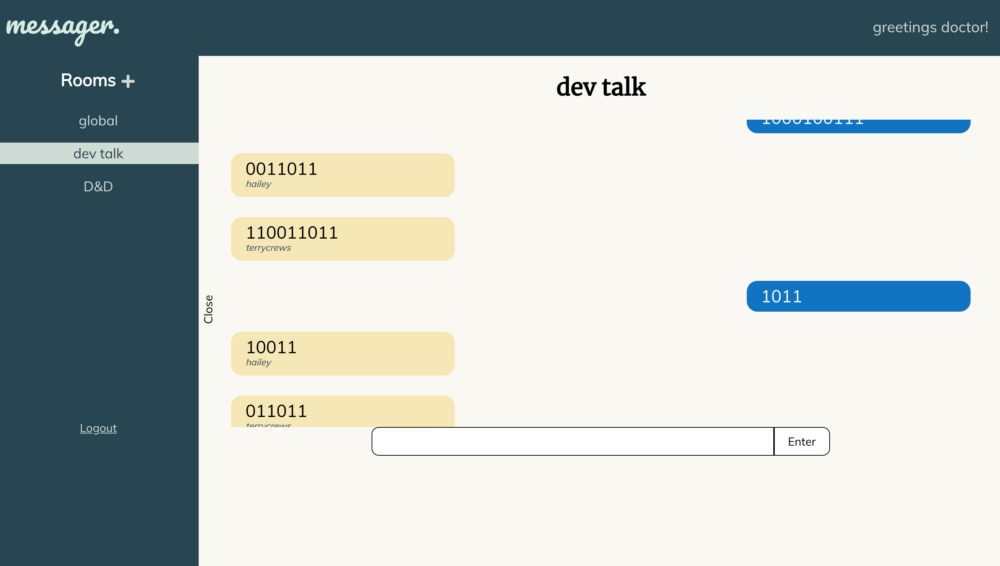
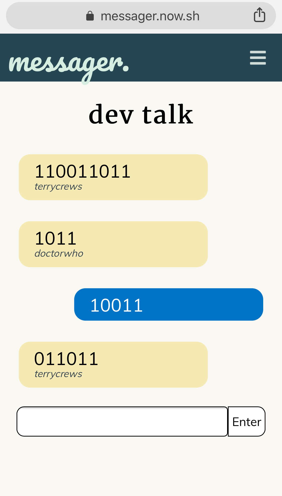
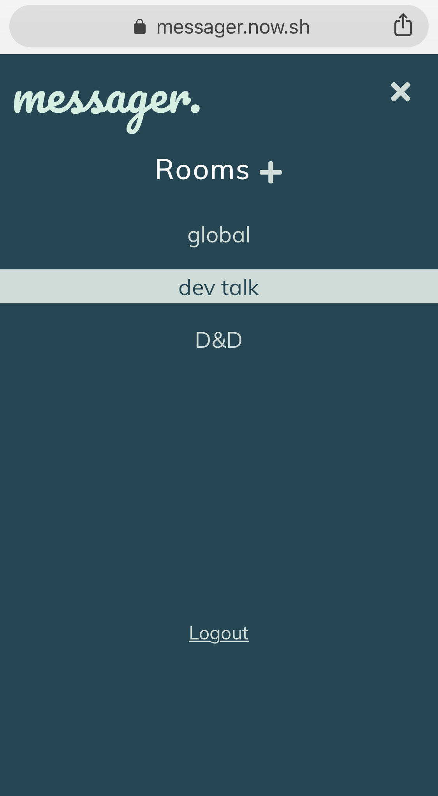

# Messager

#### ! great place to chat with friends, organize meetings, get a gaming group together, or simply share your ideas with the void.
[visit here!](http://messager.now.sh)

##### Each React component is stored at `/src/components/[ component_name ]`
* ###### For each component, there will be a 
    * test file
    * css file
    * javascript file
##### Each React route is stored at `/src/routes/[ route_name ]`
* ###### Every route will render the requisite components
##### Tech Stack:
* Javascript
* React
* Node
* Express
* PostgreSQL
## Screenshots
##### the main app
***

##### responsive design
***

